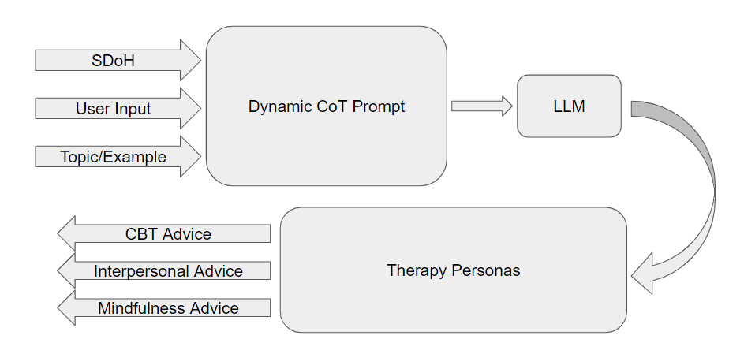
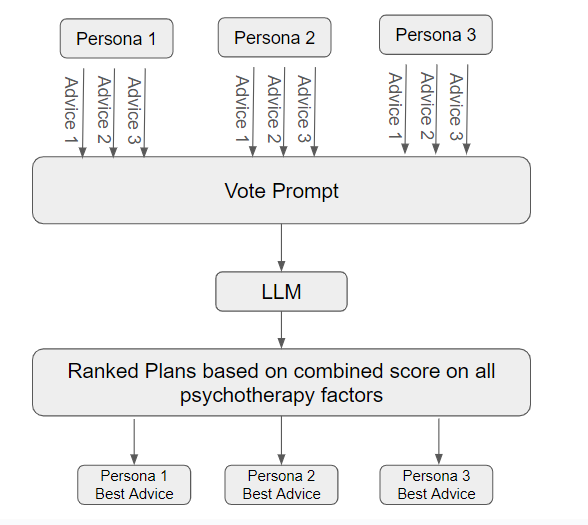
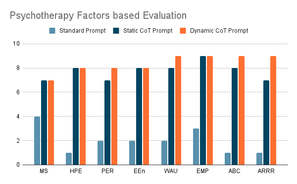

# Mental Health Agents
This repository deals with mental health counselling by using a collaborative opinion between different field experts (therapy techniques) via different prompting techniques for Large Language Models (LLM) like `GPT-3.5-Turbo`. A psychology benchmark is designed to to evaluate the final counselling advice based on different psychotherapy factors.

## Methodology

We adopt the strategy of dynamic prompting which is a combination of topic prompt, few-shot examples, social determinants of health and multiple therapist personas to arrive at a final counseling strategy:

1. Given the input, topic prompt, few-shot examples and SDoH history, we will prompt the LLM to give us the best therapy personas to handle this scenario based on different therapy techniques:

    1) Cognitive Behavioral Therapy
    2) Exposure Therapy
    3) Psychodynamic Therapy
    4) Client Centered Therapy
    5) Humanistic Therapy
    6) Interpersonal Therapy
    7) Mentalization Therapy
    8) Mindfulness Therapy.

      

2. For each ‘m’ recommended therapy techniques, prompt the LLM to generate ‘n’ counseling advice given Input, Topic Prompt, Topic Example and SDoH using a customized system prompt, such as  “You are acting as a cognitive behavioral therapist”.

3. Form a vote prompt and generate a combined score of each ‘n’ advice for each of ‘m’ therapist personas based on the following psychotherapy factors. We then select the best counseling advice based on the empathy score of each ‘m’ personas.

    1) Medium Sensitivity (MS)
    2) Hope and Positive Expectations (HPE)
    3) Persuasiveness (PER)
    4) Emotional Engagement (EEn)
    5) Warmth, Acceptance & Understanding (WAU)
    6) Empathy (EMP)
    7) Alliance-Bond Capacity (ABC)
    8) Alliance Rupture Repair Responsiveness (ARRR)

      

4. Prompt the LLM to act as therapist assistant to summarize the ‘m’ counseling responses and give final advice to the user.

## Prelimiary Analysis

We have done some analysis by using different prompts for LLM to come up with counseling advice and then evaluated the LLM response using different psychotherapy factors.

      

1. Standard prompt refers to simply asking the LLM to generate the counseling advice given the user input.
2. Static CoT prompting refers to developing a chain of thought prompting in which LLM needs to consider a thoughtful approach to produce the counseling advice given an input and few-shot examples.
3. Dynamic CoT prompting refers to designing prompting as per our proposed strategy.

It is evident that the proposed prompting methodology performs equivalent or better than the other prompting schemes on the evaluation benchmark.

